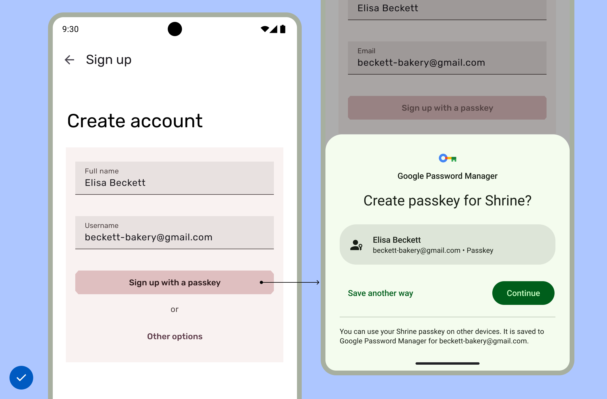

# Authentication with Passkey


<br>

## Description
An overview of my project

<br>

## Getting Started
### Installing
Run the program by entering the command below.
```bash
flutter pub get
```

<br>

### Project Structure
- 

<br>

### Version Dependencies
- [Dio : ^5.5.0+1](https://pub.dev/packages/dio)
- [GoRouter : ^14.2.3](https://pub.dev/packages/go_router)


<br>

## Examples
Get the correct user authentication information through this API call below and save it to the device you specify.
```dart

```


<br>


## Acknowledgements
- [Google Developers | UI Design](https://developer.android.com/design/ui/mobile/guides/patterns/passkeys?hl=ko)
- [Google Developers | Sign in your user with Credential Manager](https://developer.android.com/identity/sign-in/credential-manager)
- [Google Developers | Authenticate users with Sign in with Google](https://developer.android.com/identity/sign-in/credential-manager-siwg)

